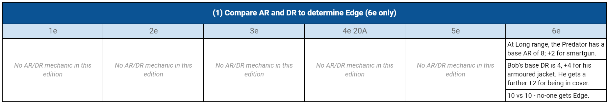

{} 
You may prefer to [download this doc as a PDF instead](Shadowrun_through_the_ages.pdf).
{}

<!-- * [Shadowrun through the ages](https://docs.google.com/document/d/1CgYPNt4ZhMIZWSCKbmqyhgrtaNTgRUKdU2iwXH_lczU/edit) - my document that breaks down key game systems (combat, initiative, spellcasting, ...) and compares them, line by line and side by side, in all six major releases of Shadowrun. -->

## Introduction

Shadowrun is 30 years old and has been through six major revisions; core mechanics have been revised multiple times. It’s interesting to put them side-by-side so we can watch them evolve.

Or at least, _I_ think it’s interesting...

### A note about dice roll outcomes
When choosing dice roll results in the example, I have not always attempted to keep parity between the systems. Often, I’ve used anydice.com to calculate the most likely outcome, and just used that. But sometimes I’ve jiggered it up or down a bit to demonstrate some aspect of one of the systems. For example, I rigged the ranged attack rolls in 1e and 2e so I could walk you through how the Rule of Six operates. 

This means you **shouldn’t compare the outcomes of these scenarios across versions** to make wider judgements about, say, the relative lethality of each edition. My goal here was to illustrate differing mechanics side-by-side, not to make an apples-with-apples comparison of the outcomes and probabilities of each test. Indeed, if you start trying to do the comparison thing, I think you’ll end up having to pull more and more of each edition’s rules in, until it becomes hopelessly complex. 

## Ranged attack resolution

Alice shoots Bob with an Ares Predator. What happens next?

Common factors across versions:

* Alice has:
    * Quickness/Agility 5
    * Intelligence 4
    * Willpower 4
    * a weapons skill of 6 and a smartgun link
        * That skill is “Firearms” in 1e/2e/6e, “Pistols” in 3e/4e/5e
    * A smartgun & cyberware smartgun link
* Bob has:
    * Body 4
    * Quickness/Agility 3
    * Intelligence 2
    * Willpower 2
    * Reaction 4
    * Intuition 4
    * an armoured jacket
    * partial cover
* This is happening at “Long” range (the exact definition of this varies a bit by edition, but it’s around 20 m.)






